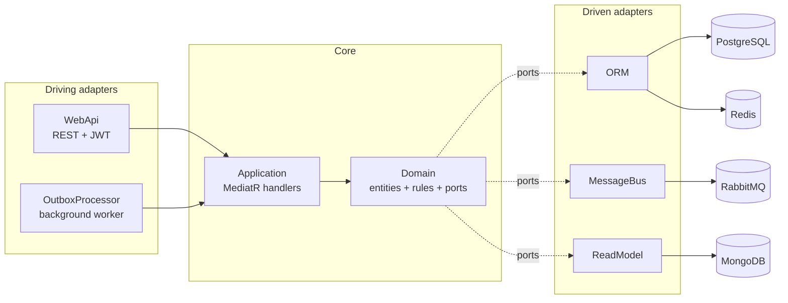

# Sales Order API — Ambev Developer Evaluation

Submission for the **Ambev Developer Evaluation — Sales Order** challenge. The original brief (use case, business rules, evaluation criteria) is preserved unedited at the bottom of this document — this top section documents what was actually delivered: how to run it, how it's put together, and what goes beyond the base requirements.

## Table of Contents

- [Getting Started](#getting-started)
- [Solution Overview](#solution-overview)
- [Documentation](#documentation)
- [Original Challenge Brief](#original-challenge-brief)

## Getting Started

### Prerequisites

- [Docker Desktop](https://www.docker.com/products/docker-desktop/) (Compose v2)
- [.NET 8 SDK](https://dotnet.microsoft.com/download/dotnet/8.0)

### Quick start (Windows)

From `template/backend`, run:

```
run-local.bat
```

This brings up Postgres, RabbitMQ, Redis and MongoDB via Docker Compose, applies pending EF Core migrations, and starts the WebApi and the OutboxProcessor worker each in their own console window.

### Quick start (macOS/Linux/manual)

```bash
cd template/backend

# 1. Infrastructure
docker compose up -d --wait ambev.developerevaluation.database ambev.developerevaluation.rabbitmq ambev.developerevaluation.cache ambev.developerevaluation.nosql

# 2. Migrations
dotnet ef database update --project src/Ambev.DeveloperEvaluation.ORM --startup-project src/Ambev.DeveloperEvaluation.WebApi

# 3. WebApi (terminal 1)
cd src/Ambev.DeveloperEvaluation.WebApi && dotnet run

# 4. OutboxProcessor — separate process, must run alongside the WebApi (terminal 2)
cd src/Ambev.DeveloperEvaluation.OutboxProcessor && dotnet run
```

The OutboxProcessor is intentionally a separate long-running process, not something the WebApi starts internally — see [Solution Overview](#solution-overview) for why.

### URLs & ports

| Service | URL | Credentials |
|---|---|---|
| Swagger | https://localhost:7181/swagger | — |
| PostgreSQL | `localhost:5432` | `developer` / `ev@luAt10n` |
| Redis | `localhost:6379` | password `ev@luAt10n` |
| RabbitMQ UI | http://localhost:15672 | `guest` / `guest` |
| MongoDB | `localhost:27017` | `developer` / `ev@luAt10n` |

### Running the tests

```bash
cd template/backend
dotnet test tests/Ambev.DeveloperEvaluation.Unit/Ambev.DeveloperEvaluation.Unit.csproj
```

232 tests, xUnit + NSubstitute + FluentAssertions + Bogus, covering domain rules, application handlers, and infrastructure-level behavior (outbox capture, cache-aside) where a handler-level mock wouldn't exercise it.

## Solution Overview

### Architecture

Clean/Hexagonal Architecture (Ports & Adapters): `Domain` and `Application` are the core and never depend on a concrete database, cache, broker, or web framework — only on interfaces they declare themselves. Everything that talks to the outside world implements one of those interfaces from an adapter project.



See [Project Structure](/.doc/project-structure.md) for the full directory breakdown and the reasoning behind each project boundary.

### Highlights beyond the base requirements

- **Sale as a real domain aggregate** — `Sale`/`SaleItem` snapshot customer, branch and product data at the moment of purchase (the README's own External Identities + denormalization guidance), so editing a customer or branch record later never rewrites history.
- **Two-layer authorization** — role-based at the controller, ownership/scope-based in the handler. `Manager` is scoped to the specific branch an `Admin` assigns them to (`BranchManager` join table), not global authority.
- **Transactional Outbox, actually wired to a broker** — the brief only asks for events to be logged; this implementation captures domain events atomically in the same DB transaction as the state change, and a separate worker (`OutboxProcessor`) dispatches them to RabbitMQ with retry/backoff.
- **Cache-Aside (Redis)** on `Product`/`Branch` reads, baked into the repository so it's transparent to callers, with invalidation on write.
- **CQRS-lite read model (MongoDB)** — `GET /api/sales/history/{userId}` reads a denormalized sale-history projection with no Postgres join at all; Postgres stays the system of record, Mongo is a disposable, eventually-consistent copy.
- **Soft-delete-aware unique constraints** — partial unique indexes (`WHERE "DeletedAt" IS NULL`) so a deleted record's unique value (email, address, evaluation) can be reused, instead of permanently squatting the slot.

## Documentation

- [Overview](/.doc/overview.md) — the evaluation's own list of assessed skills
- [Tech Stack](/.doc/tech-stack.md)
- [Frameworks](/.doc/frameworks.md)
- [General API Definitions](/.doc/general-api.md) — pagination, ordering, filtering, error format
- [Project Structure](/.doc/project-structure.md)

---

## Original Challenge Brief

`READ CAREFULLY`

### Use Case
**You are a developer on the DeveloperStore team. Now we need to implement the API prototypes.**

As we work with `DDD`, to reference entities from other domains, we use the `External Identities` pattern with denormalization of entity descriptions.

Therefore, you will write an API (complete CRUD) that handles sales records. The API needs to be able to inform:

* Sale number
* Date when the sale was made
* Customer
* Total sale amount
* Branch where the sale was made
* Products
* Quantities
* Unit prices
* Discounts
* Total amount for each item
* Cancelled/Not Cancelled

It's not mandatory, but it would be a differential to build code for publishing events of:
* SaleCreated
* SaleModified
* SaleCancelled
* ItemCancelled

If you write the code, **it's not required** to actually publish to any Message Broker. You can log a message in the application log or however you find most convenient.

### Business Rules

* Purchases above 4 identical items have a 10% discount
* Purchases between 10 and 20 identical items have a 20% discount
* It's not possible to sell above 20 identical items
* Purchases below 4 items cannot have a discount

These business rules define quantity-based discounting tiers and limitations:

1. Discount Tiers:
   - 4+ items: 10% discount
   - 10-20 items: 20% discount

2. Restrictions:
   - Maximum limit: 20 items per product
   - No discounts allowed for quantities below 4 items
